# Physics Playground

Interactive physics experiments in the browser, each paired with the theory it should match and a measurement of how well it does. Built with React 19, Vite and the Canvas 2D API, with no backend.

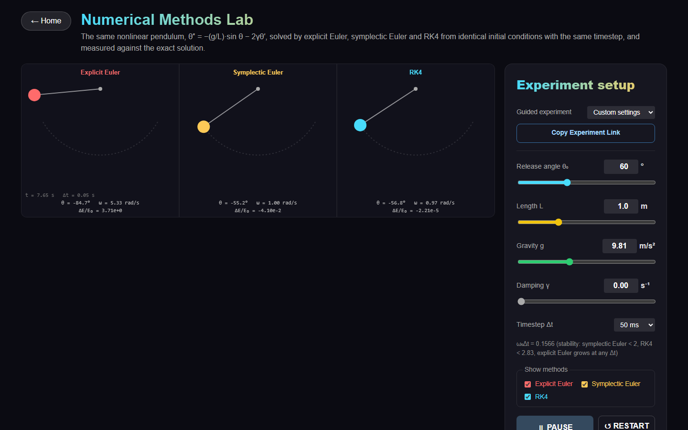

## Overview

Most physics animations show motion. This project measures it. Every lab answers two questions: what the model predicts, and how far the numerical simulation is from the exact answer, and why.

- The **same model** feeds the worked solvers, the simulations and the tests. A solved problem opens in its lab with one click, and a test checks both give the same number.
- Numerical methods are **compared on equal terms**: same initial state, same timestep, the same exact reference, and the cost counted in derivative evaluations.
- Experiments are **reproducible**: every physical and numerical parameter lives in the URL, eight guided experiments are one click away, and data can be logged and exported as CSV.
- Every lab states its **equations, assumptions, units and limitations**.

## Live Demo

**https://pradyumn-tangirala.github.io/Physics-Playground/**

The site is published by GitHub Actions on every push to `main` (see [Deployment](#deployment)). The work described here was developed on a branch. Until it is merged and the repository's Pages source is set to GitHub Actions, the live site shows an earlier version.

## Key Features

- **Five labs:** oscillators, numerical methods, projectile motion with drag, analytical wave interference, and a finite-difference (FDTD) wave-equation solver.
- **Three integrators:** explicit Euler, symplectic Euler and RK4, behind one interface, selectable at eight fixed timesteps from 0.5 ms to 100 ms.
- **Verification panels:** the analytical result, the simulated result, and the absolute and relative error, for the pendulum, the spring, the projectile and the wave pattern. This is verification (does the code solve its model correctly?), not validation against laboratory measurements: no lab data is used.
- **Exact references:**
  - **Pendulum:** the nonlinear motion via Jacobi elliptic functions.
  - **Spring:** the damped motion in all three regimes.
  - **Projectile:** the drag-free flight.
  - **Waves:** the Fraunhofer (far-field) formula, an approximation that the simulation should approach as the screen moves away.
- **Experiments:**
  - **Accuracy vs cost:** error against derivative evaluations for every method and timestep.
  - **Timestep convergence:** observed order of accuracy.
  - **Period against amplitude:** the nonlinear pendulum.
- **Worked solvers:** for projectiles, the pendulum and the double slit, each with **"Simulate this"**.
- **Experiment sharing:**
  - Parameters are encoded in the URL, with a **Copy Experiment Link** button.
  - Eight **guided experiments** each say what to look for.
- **Data logging and export:**
  - **Logging:** start, stop, clear and export CSV, sampled at the simulation's own steps.
  - **Reports:** full-resolution flight data and screen-intensity profiles as CSV.
- **Input:** keyboard-operable everywhere; drag the pendulum with mouse, touch or pen; layouts for phones and tablets; respects reduced-motion settings.

## Simulations

### Oscillator Lab (`#/shm`)

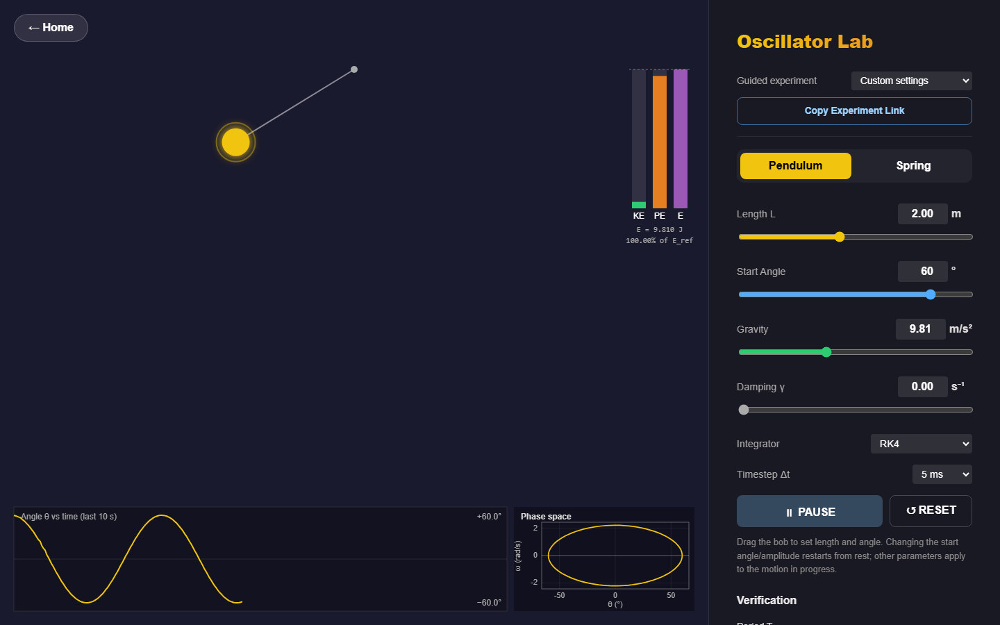

- **Models:** a damped nonlinear pendulum and a damped spring–mass oscillator.
- **Equations:**
  - pendulum: θ″ = −(g/L)·sin θ − 2γθ′
  - spring: x″ = −(k/m)·x − 2γx′
  - energy (pendulum): E = ½mL²θ′² + mgL(1 − cos θ)
- **Assumptions:** point mass on a massless rigid rod; ideal Hooke spring; uniform gravity; viscous damping.
- **Numerical method:** the selected integrator at a fixed Δt (default RK4, 5 ms), stepped independently of the frame rate.
- **Visualization:**
  - the pendulum or spring, draggable to set the release point
  - θ(t) or x(t) over the last 10 s, and a phase portrait
  - energy bars against the energy at release
  - the verification panel:
    - measured period against the exact period 4√(L/g)·K(sin²(θ₀/2)), with zero crossings located by cubic Hermite interpolation inside the step
    - θ(t) against the exact elliptic-function solution
    - energy against the energy at release
  - the small-angle period 2π√(L/g), shown beside the panel as a model comparison (it differs from the exact period because of sin θ ≈ θ, not because of numerical error)
  - data logging

### Numerical Methods Lab (`#/numerical-methods`)

- **Models:** the same nonlinear pendulum, solved three times in lock-step from identical initial conditions.
- **Measurements:**
  - the angle error |θ − θ_exact|, the energy drift ΔE/E₀ and the phase portrait over time
  - derivative evaluations and steps, live
  - the measured period of each method against the exact period
- **Reference:** the exact solution sin(θ/2) = sin(θ₀/2)·cd(ω₀t | sin²(θ₀/2)). With damping there is no closed form, so the reference is RK4 at Δt/20.
- **Experiments:** accuracy vs cost (below) and period vs amplitude (5°–175°). Both run in a Web Worker, so the page keeps animating while they compute.

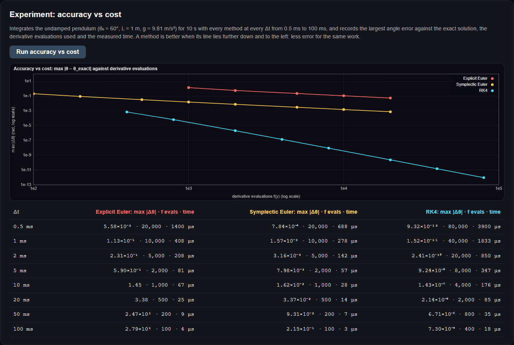

### Projectile Lab (`#/projectile`)

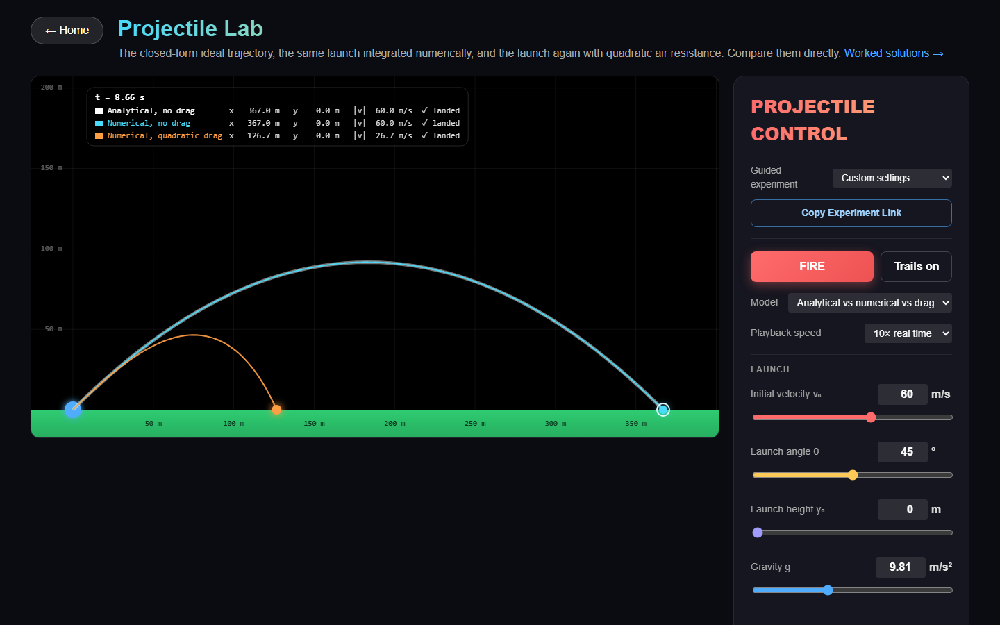

- **Models:** an ideal projectile (closed form) and quadratic air drag.
- **Equations:**
  - ideal: x = v₀ cos θ·t, y = y₀ + v₀ sin θ·t − ½gt²
  - drag: a = −g·ŷ − k|v|v, with k = ρC_dA/2m
- **Assumptions:** point mass with no spin; still air of constant density; constant C_d; flat ground.
- **Numerical method:** the selected integrator. The landing and the apex are located inside the final step by cubic Hermite interpolation and bisection, not by stopping at the last step. Unstable runs (too large a Δt for the drag) are detected and labelled.
- **Visualization:**
  - three trajectories flown together: closed form, numerical without drag, numerical with drag
  - an auto-zooming camera
  - flight metrics
  - a verification panel against the closed form
  - a log–log timestep-convergence study
  - CSV export of every integration step

### Wave Interference Lab (`#/simulation`)

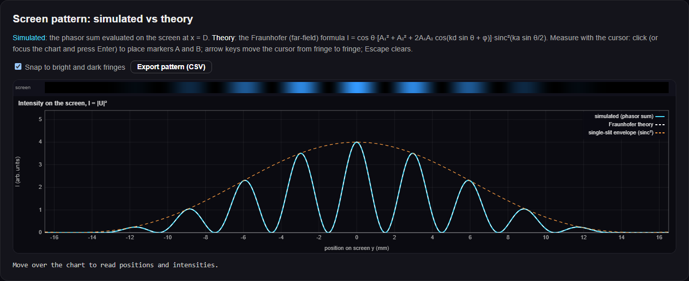

- **Model:** a Huygens–Fresnel phasor sum for one or two slits, U = Σⱼ (Aⱼ/n)·√(D/rⱼ)·e^{i(k rⱼ + φⱼ)}, with intensity I = |U|².
- **Assumptions:** scalar, monochromatic, coherent waves in 2-D; each slit is a row of point sources (Kirchhoff). Each source radiates the far-field form of a 2-D cylindrical wave, √(D/r)·e^{ikr}, which is accurate when r ≫ λ: within about a wavelength of a slit, the drawn field is only approximate. There is no obliquity factor.
- **Numerical method:** this lab evaluates a solution formula; it does not solve the wave equation. On the screen, sub-sources are spaced so that neighbouring phases differ by less than π/25, which keeps the midpoint-rule amplitude error below 10⁻³, up to a cap of 4000 sub-sources per slit.
- **Setups:** a ripple tank, microwaves, sound, and a He-Ne laser.
- **Visualization:**
  - the instantaneous field or the time-averaged intensity, drawn to scale for the macroscopic setups
  - the screen pattern against the Fraunhofer formula, with its sinc² envelope
  - a measurement cursor for fringe spacing
  - predicted vs measured fringe positions
  - CSV export of the profile

In the screenshot (λ = 600 nm, d = 0.2 mm, a = 0.04 mm), the fifth order is missing because d/a = 5 puts it on an envelope zero.

### Numerical Wave Equation Lab (`#/waves/fdtd`)

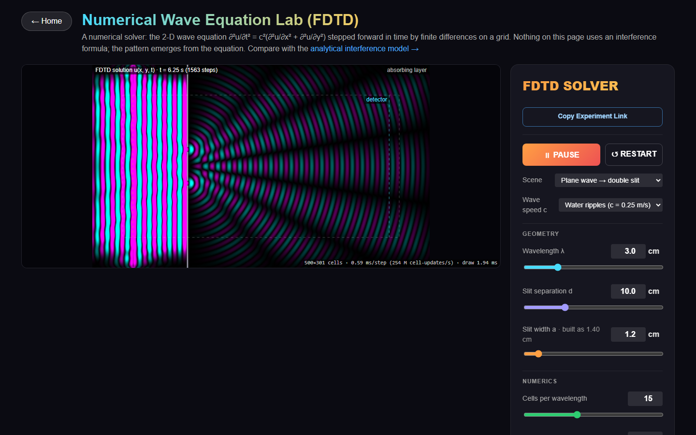

- **Model:** ∂²u/∂t² = c²(∂²u/∂x² + ∂²u/∂y²).
- **Numerical method:**
  - **Scheme:** second-order FDTD (leapfrog).
  - **Stability:** a CFL-limited timestep, C = cΔt/Δx ≤ 1/√2, with a warning and blow-up detection beyond it.
  - **Boundaries:** absorbing (a graded sponge plus a first-order Mur condition) or reflective.
  - **Geometry:** a rigid barrier with one or two slits, or point sources.
- **Visualization:** the field u(x, y, t), and a detector line compared with the analytical model for the same geometry, which is computed in a completely different way.

### Worked solvers and guided experiments

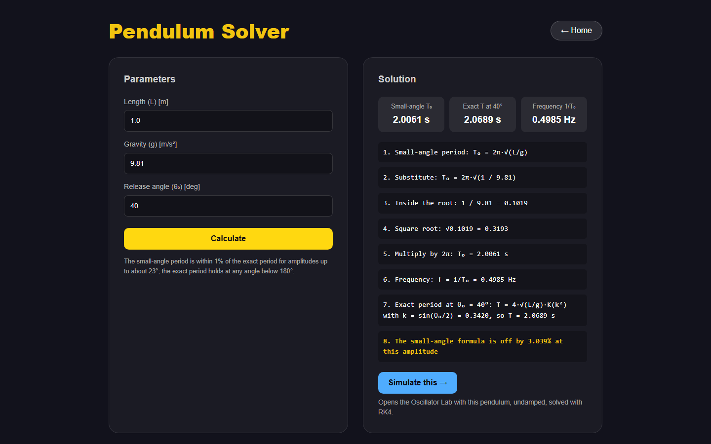

The projectile, pendulum and double-slit solvers show numbered steps. **"Simulate this"** opens the lab with exactly those parameters. If the lab cannot represent a value, the button is replaced by the reason, for example a wavelength outside the visible range. The [guided experiments](docs/screenshots/guided-experiments.png) page lists the eight presets:

1. Small-angle pendulum
2. Nonlinear pendulum
3. Euler energy drift
4. RK4 accuracy
5. Double-slit interference
6. Single-slit diffraction
7. Projectile without drag
8. Projectile with drag

## Numerical Methods

All three methods implement `step(y, f, h, t)` on a state vector and know nothing about the physics. A model supplies only `f`. Details and derivations are in [NUMERICAL_METHODS.md](NUMERICAL_METHODS.md).

| Method | Update | Global error | Evaluations per step | Behaviour on oscillators |
|---|---|---|---|---|
| Explicit Euler | y₁ = y₀ + h·f(y₀) | O(h) | 1 | The phase-space map has determinant 1 + ω²h² > 1, so energy grows at every Δt |
| Symplectic Euler | v₁ = v₀ + h·a(x₀); x₁ = x₀ + h·v₁ | O(h) | 1 | Without damping it is area-preserving, so the energy error stays bounded; stable for ω₀h < 2 |
| RK4 | y₁ = y₀ + h/6·(k₁ + 2k₂ + 2k₃ + k₄) | O(h⁴) | 4 | Small, slowly growing energy error; stable for ω₀h < 2.83 |
| FDTD (waves) | uⁿ⁺¹ = 2uⁿ − uⁿ⁻¹ + C²·∇²ₕuⁿ | O(Δx², Δt²) | — | Stable for C ≤ 1/√2; with rigid edges and no source it conserves a discrete energy, up to float32 round-off |

## Verification

The simulations are checked against exact solutions and theory: verification, not validation against laboratory data. Every number below is enforced by an automated test, or is a recorded measurement next to the test bound that enforces it. How to reproduce each is in [TESTING.md](TESTING.md).

- **Test suite:**
  - **Vitest:** 537 tests in 34 files (physics 192, simulation 66, validation 180, UI 99).
  - **Playwright:** 77 end-to-end tests run in each of five browser/device projects, plus 4 performance tests.
- **Convergence:** measured orders of accuracy, against exact solutions or a converged reference.
  - explicit and symplectic Euler: 1.00
  - RK4, pendulum at 30°: 4.00
  - RK4, projectile with drag: 4.05
  - FDTD dispersion: second order
- **Accuracy vs cost:** pendulum at θ₀ = 60° for 10 s, largest angle error against the exact solution.

  | Method, Δt | Derivative evaluations | max \|θ − θ_exact\| (rad) |
  |---|---|---|
  | Explicit Euler, 0.5 ms | 20 000 | 5.6×10⁻² |
  | Symplectic Euler, 0.5 ms | 20 000 | 7.8×10⁻⁴ |
  | RK4, 100 ms | 400 | 7.3×10⁻⁴ |
  | RK4, 10 ms | 4 000 | 1.4×10⁻⁷ |

- **Energy drift:** same pendulum, Δt = 10 ms, after 10 s.
  - explicit Euler: +110% (the swing grows)
  - symplectic Euler: −1.4%
  - RK4: −1.1×10⁻⁸
- **Exact references cross-checked:**
  - **Elliptic pendulum solution:** agrees with RK4 at Δt = 1 ms at every step over 10 s; largest difference 2.5×10⁻¹¹ rad at θ₀ = 150° (test bound 5×10⁻¹¹).
  - **RK4 periods:** match the exact elliptic-integral period to better than 10⁻⁹ at Δt = 5 ms and 10⁻⁸ at Δt = 10 ms, at 5° and 90° (tested). Crossing times are found by cubic Hermite interpolation; the earlier linear interpolation was itself the largest error (10⁻⁶ on a damped spring at 10 ms).
- **Waves:**
  - **Fringe spacing:** the phasor-sum simulation matches λD/d within 0.01% for the He-Ne laser setup (tested).
  - **FDTD:** reproduces its wavelength within 0.2% of the discrete dispersion relation (measured −0.04%) and within 1% of c/f, and a pulse travels at c within 1% (tested).
- **Solvers and simulation share one model:** for each solver, the problem opened with "Simulate this" gives the same analytical result in the lab (`tests/validation/presets.test.js`). Both sides call the same function, so this checks the parameter hand-off through the link; the physics itself is checked against the independent references above.
- **Coverage (lines):**
  - physics 99.7%
  - simulation 97.2%
  - utils 100%
  - experiments 100%
  - whole project 91.7%

## Architecture

```
React UI            src/pages, src/components     parameters, controls, panels; owns nothing per-frame
   ↓
Simulation Layer    src/simulation                init / step / sync definitions, fixed-step time, one rAF loop per page
   ↓
Physics Engine      src/physics                   pure functions in SI units: models, integrators, exact solutions, experiments
   ↓
Renderer            src/rendering                 state → Canvas pixels; reads state, never writes it
```

`src/experiments` sits beside the simulation layer. It holds each lab's parameter schema (ranges, defaults, link names), the guided presets and the model cards. The sliders, links and presets all read the same schema, so they cannot disagree.

React never runs on the per-frame path. The simulation lives in a ref, the loop reads the latest parameters through a ref, and text readouts refresh four times a second. Full details are in [ARCHITECTURE.md](ARCHITECTURE.md), and the conventions are in [CODE_QUALITY.md](CODE_QUALITY.md).

## Physics Models

| Model | Equation | Exact reference used for verification |
|---|---|---|
| Pendulum | θ″ = −(g/L)·sin θ − 2γθ′ | T = 4√(L/g)·K(k²), sin(θ/2) = k·cd(ω₀t \| k²), k = sin(θ₀/2) |
| Spring | x″ = −(k/m)x − 2γx′ | under-, critically and overdamped closed forms |
| Projectile | a = −g·ŷ − k\|v\|v, k = ρC_dA/2m | the parabola when k = 0; 1-D vertical solutions with drag |
| Interference | U = Σ (A/n)·√(D/r)·e^{ikr}, I = \|U\|² | Fraunhofer: I(θ) = cos θ·[A₁² + A₂² + 2A₁A₂ cos(kd sin θ + φ)]·sinc²(ka sin θ/2) |
| Wave equation | ∂²u/∂t² = c²∇²u | the analytical model on the detector line; the discrete dispersion relation |

Derivations and measured behaviour are in [PROJECTILE_MODEL.md](PROJECTILE_MODEL.md), [WAVE_MODEL.md](WAVE_MODEL.md) and [NUMERICAL_METHODS.md](NUMERICAL_METHODS.md).

## Testing

| Tool | Scope |
|---|---|
| **Vitest** (Node) | Physics against closed forms, conservation laws, limits and observed convergence orders. Every solver against bad input (zero, negative, NaN, Infinity, empty, non-numeric). Experiment links, presets, data logging and CSV |
| **Vitest + React Testing Library** (jsdom) | Every page through its roles and labels. The canvas is replaced by a recording context, and `requestAnimationFrame` by a manual frame scheduler, so tests control time exactly |
| **Playwright** | The production build under its real base path in Chromium, Edge, Firefox (CI), a Pixel 7 and a Galaxy Tab S4: routes, controls, solvers, links, clipboard, CSV download, mouse/touch/pen drags, axe-core WCAG 2.1 AA audit, layouts, error recovery, frame times and memory |

```bash
npm test               # Vitest (537 tests)
npm run test:coverage  # with coverage floors
npm run test:e2e       # Playwright, all projects
npm run test:ci        # lint + coverage + E2E
```

## Performance

Measured in the production build in Chromium, at device-pixel ratio 1, on the development machine:

| Measurement | Result |
|---|---|
| Entry bundle (React, router, landing page) | 277.8 kB, 89.4 kB gzipped; each lab is a separate 10–26 kB chunk |
| Analytical wave lab frame | 1.67 ms (field precompute after a change: 4.7 ms) |
| FDTD | 0.45 ms per solver step (500 × 301 grid), 1.85 ms per drawn frame |
| Speed-up over the first implementations | Wave field 2.7× (8.4× with wide slits). FDTD step 1.5× on the development machine, but 0.73× (slower) on GitHub's Linux CI runner, so that optimisation is not a portable win |
| Memory | +1.6 MB JS heap after 20 round trips through every lab |
| Animation loops | Exactly one per mounted page, none after leaving |
| Accuracy-vs-cost study (24 timed integrations) | Runs in a Web Worker: longest frame gap 33 ms during the run, against 167 ms when the same study runs on the main thread |

Timings vary with hardware. The tests enforce loose budgets, not these exact values.

## Accessibility

- **Keyboard:**
  - Every control works from the keyboard.
  - Sliders take arrows, PageUp/PageDown and Home/End, with a validated numeric field (errors are announced).
  - The wave lab's measurement cursor moves between fringes with the arrow keys; Enter places a marker.
  - Wide tables scroll inside focusable regions.
- **Screen readers:**
  - Canvases have descriptive labels.
  - Every number that matters is also in the DOM.
  - Status messages are live regions.
- **Touch and pen:** dragging the pendulum or spring uses Pointer Events with pointer capture.
- **Phones:** below 900 px the labs stack the canvas above the controls; buttons are at least 44 px high.
- **Motion:**
  - `prefers-reduced-motion` stops the decorative animations.
  - The landing background also has a pause button.
- **Audit:** an axe-core WCAG 2.1 A/AA audit runs on every route in CI.

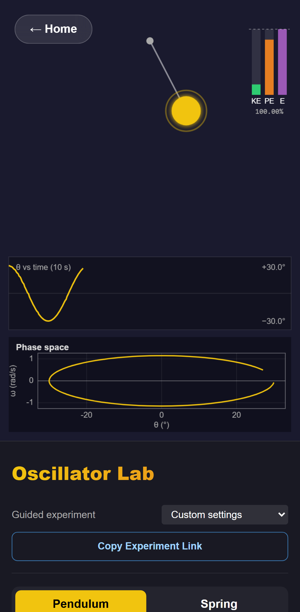

## CI/CD

GitHub Actions, using `npm ci` from the lockfile and Node from `.nvmrc`:

- **Pull requests (`ci.yml`):**
  - lint, tests with coverage floors, and the production build
  - Playwright in a matrix: Chromium, Firefox, Edge, phone, tablet
  - a separate performance and memory-leak job
- **Push to `main` (`deploy.yml`):** lint, test and build, then Chromium E2E run against the Pages artifact itself (downloaded and unpacked, not rebuilt). That same artifact is then published with the official Pages actions (`upload-pages-artifact`, `deploy-pages`).
- **Dependencies:** Dependabot opens weekly grouped npm PRs, with major versions in separate PRs, and monthly Actions updates.

## Experiment Sharing

The URL describes the experiment:

```
#/shm?mode=pendulum&angle=40&length=1.5&g=9.81&amplitude=1&mass=2&k=10&damping=0&method=rk4&dt=0.005
#/projectile?mode=compare&v=30&angle=45&h=0&g=9.81&rho=0&cd=0.47&area=0.0042&mass=0.145&method=rk4&dt=0.01&speed=1
#/simulation?setup=laser&mode=double&wavelength=6e-7&separation=0.0002&width=0&distance=1&…
```

- **Opening a link** loads exactly that experiment.
- **Changing a parameter** updates the address after a 0.5 s pause. Reloading keeps the experiment, and the Back button returns to the previous one.
- **Copy Experiment Link** puts the current link on the clipboard. If the clipboard is blocked, it shows the link for manual copying.
- **Invalid values** (out of range, unknown method, non-numeric) are **not clamped**. The lab keeps its default and lists each rejected value with the reason.
- **One schema per lab.** Encoding, decoding and validation are driven by the schema in `src/experiments/labs.js`, the same one that configures the sliders.

## Data Export

- **Data logging** (Oscillator and Numerical Methods labs):
  - **Controls:** Start, Stop, Clear, Export CSV.
  - **Sampling:** at every integration step or every 0.01, 0.05 or 0.1 s of simulated time.
  - **Columns:** time, position, velocity, kinetic, potential and total energy, method, Δt and the physical parameters. The Numerical Methods Lab writes one row per method, plus the reference angle, the error and the evaluation count.
  - **Resets:** a reset starts a new run number. The log stops itself at 200 000 rows.
  - **Kept for the session:** logs survive choosing a guided experiment, the Back button and leaving the lab (a new experiment continues as a new run). The browser asks before a reload or close discards rows that have not been exported.
- **Experiment reports:**
  - **Projectile:** every integration step of every trajectory, with energies and parameters.
  - **Wave lab:** the simulated and theoretical screen intensity.
- **File format:**
  - Files start with `#` metadata lines: experiment, model equation, method, the experiment link and the export time.
  - Then comes a header and the data, with RFC 4180 quoting and numbers at full precision.
  - pandas can read them with `comment='#'`.

## Screenshots / GIFs

All screenshots are of the current build, captured by `scripts/capture-screenshots.mjs` (see [Development](#development)) into [`docs/screenshots/`](docs/screenshots/):

| | |
|---|---|
| 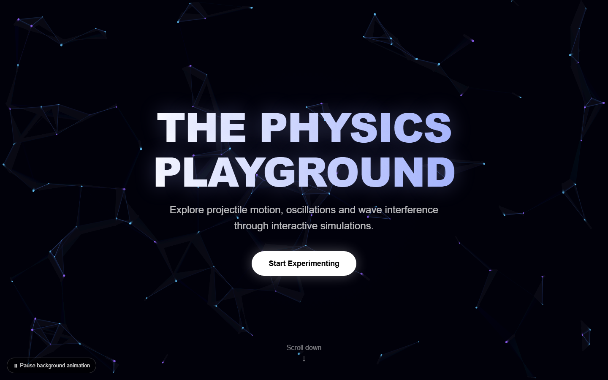 | 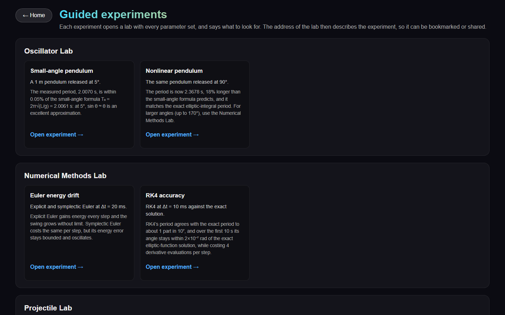 |
| 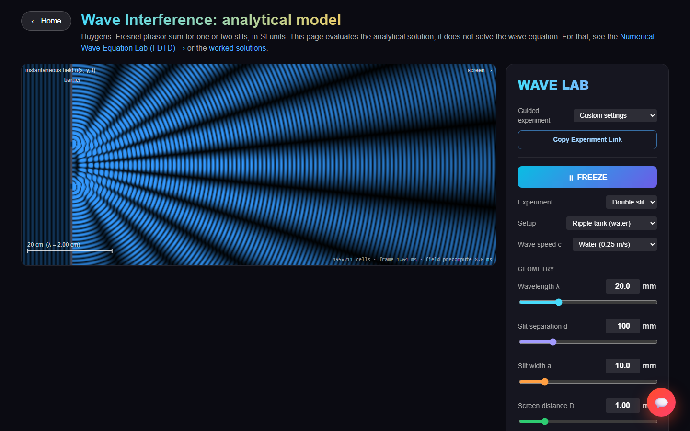 | 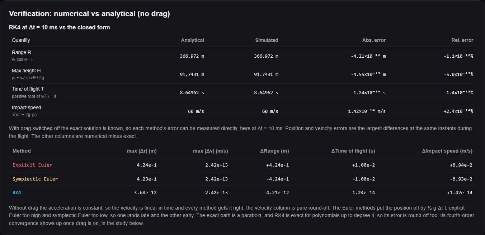 |

There are no GIFs yet; the live demo shows the motion.

## Project Structure

```
src/
  physics/        models in SI units: integrators.js, elliptic.js, analysis.js, constants.js,
                  pendulum/, spring/, projectile/, waves/ (interference, field, fdtd, doubleSlit)
  simulation/     simulation definitions (init/step/sync), useSimulation, useAnimationLoop, dataLog
  rendering/      canvas renderers, charts.js, canvasSize.js (device-pixel ratio)
  experiments/    lab schemas, URL encoding, presets, model cards, URL-sync hooks
  components/     ParamSlider, SimulationCanvas, ExperimentBar, ValidationPanel, DataLogPanel,
                  ModelCard, SolverPage, ErrorBoundary, …
  pages/          one component per route (lazy-loaded): OscillatorLab, NumericalMethodsLab,
                  ProjectileLab, WaveInterferenceLab, WaveEquationLab, three solvers, ExperimentsPage
  utils/          units, validation, formatting, CSV, fixed-step time
tests/            ui/ (React Testing Library), validation/, perf/
e2e/              Playwright specs
scripts/          capture-screenshots.mjs, coverage-by-layer.mjs
.github/          CI, deployment and Dependabot configuration
```

## Installation

Requires Node.js 22.13+ (or 24+); `.nvmrc` pins 22.

```bash
git clone https://github.com/Pradyumn-Tangirala/Physics-Playground.git
cd Physics-Playground
npm ci
```

## Development

```bash
npm run dev          # development server: http://localhost:5173/Physics-Playground/
npm run lint         # ESLint
npm test             # unit and UI tests
npm run build        # production build into dist/
npm run preview      # serve dist/ at http://localhost:4173/Physics-Playground/
```

End-to-end tests need the browsers once: `npx playwright install chromium firefox` (the `edge` project uses an installed Microsoft Edge).

To regenerate the screenshots, run `npm run build && npm run preview`, then in a second terminal run `node scripts/capture-screenshots.mjs`.

## Deployment

The site is deployed by `.github/workflows/deploy.yml` only:

1. **On push to `main`:** `npm ci`, lint, tests, `vite build`.
2. **Test the build:** Chromium end-to-end tests against the same commit.
3. **Publish:** `deploy-pages` publishes the `dist/` artifact from step 1 to GitHub Pages.

There is no manual deploy script. The repository's Pages source must be set to **GitHub Actions** (a one-time setting). Hash routing means GitHub Pages needs no rewrite rules. More detail is in [PRODUCTION_READINESS.md](PRODUCTION_READINESS.md).

## Limitations

- **Models:**
  - **Projectile:** point mass, constant C_d and still air, so there is no Magnus force, wind or drag crisis.
  - **Waves:** scalar and 2-D; no polarisation.
  - **Analytical wave lab:** evaluates a formula. It does not show barrier reflections or slit thickness; the FDTD lab does.
- **Analytical references are limited:**
  - There is no closed form for the damped nonlinear pendulum or for 2-D drag, so those are verified against fine-step RK4.
  - The Oscillator Lab limits release angles to ±90° so the bob stays in view. The Numerical Methods Lab goes to 170°.
- **Optical scales:** the laser screen pattern is computed exactly, but the 2-D field cannot be drawn to scale. The FDTD lab handles only macroscopic waves (ripple tank, sound).
- **Browsers:** Safari/WebKit is not tested. Firefox is tested only in CI (its Playwright build does not start on the development machine). Phones and tablets are emulated, not real devices.
- **Data logging lives in memory:** it is capped at 200 000 rows and lost on reload unless exported (the browser asks first).
- **Fixed-step methods only:** no adaptive step control and no implicit integrators.

## Future Work

- **Velocity Verlet**, a second-order symplectic method, to complete the comparison.
- **Adaptive step size**: an embedded RK4(5) with error control, compared on the accuracy-vs-cost chart.
- **WebKit** in the Playwright matrix.
- **The FDTD detector** checked numerically, by fringe spacing, against the analytical model in a verification panel, as the other labs are.
- **A driven, damped oscillator** with a resonance curve, reusing the oscillator model interface.

## Technical Highlights

- **Numerical integration:**
  - one integrator interface across ODE models of any dimension
  - event location by Hermite interpolation and bisection inside a step (landing, apex, zero crossings)
  - detection of unstable runs instead of reporting nonsense
- **Physics verification:**
  - exact references implemented from first principles (complete elliptic integral by AGM, Jacobi sn/cn/dn by descending Landen)
  - observed convergence orders
  - tolerances set from each method's theoretical order where one applies, otherwise from recorded measurements
  - a test that each solver and its simulation give the same answer
- **Canvas and ImageData rendering:**
  - wave fields written straight into typed arrays with colour lookup tables
  - one reused `ImageData` and offscreen canvas per page
  - canvases at device-pixel resolution (capped at 2×)
- **FDTD:** a leapfrog solver with a CFL-limited timestep, a sponge plus Mur absorbing boundary, wall masks with snapped slit geometry, discrete energy conservation and blow-up detection.
- **Performance work, measured before and after:** kernel benchmarks keep the old implementations as baselines (wave field 2.7–8.4× faster), alongside frame-time and heap-leak checks in a real browser.
- **Automated testing:** 537 unit/UI tests plus 77 E2E tests across five browser/device projects, including an axe-core audit and touch/pen input.
- **CI/CD:** PR checks across a browser matrix; the end-to-end tests run on the exact artifact that is deployed; Dependabot.
- **Web Worker:** the long studies run off the main thread (longest frame gap 33 ms during a run, against 167 ms on the main thread), with a main-thread fallback.
- **URL state serialization:**
  - schema-driven encoding with dependent bounds (the wave lab's ranges depend on its setup)
  - rejection instead of clamping
  - a remount-on-navigation model that keeps live state and the address bar consistent
  - two concurrency bugs, found by E2E on phone and tablet, fixed with an ownership check
